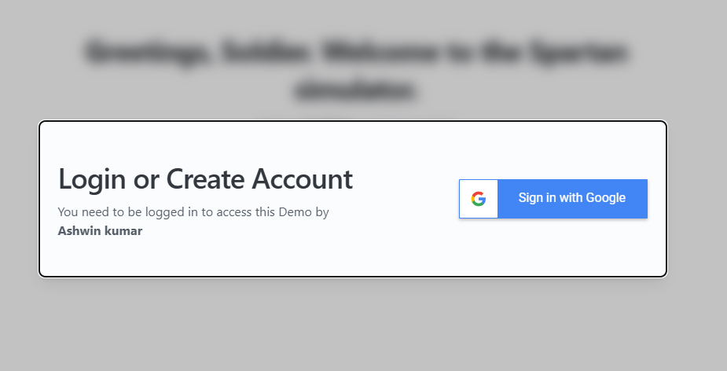

# The Mighty Spartan Chat Simulator!

A Chatbot built using LLamaindex that simulates a intelligent Spartan WARRIOR!

## Bug Fixes:

- Fixed an UI Bug where chat list wont take full h
  eight

### PreRequisites:

> Make sure you have MongoDB installed! https://www.mongodb.com/docs/manual/installation/

- Create a firebase project and place your key in serviceAccountKey.json, or download from `https://drive.google.com/drive/folders/1jhqf3SObkkq-qb106Eb2vjPfYXBESGjK?usp=drive_link`
- Download the `.env` file from the same link and place it in the `/frontend/` folder.
- Run the following script from the root folder

```
python -m venv deasie
source ./deasie/bin/activate
```

This will create a virtual environment. Additionally,

```
pip install -r requirements.txt
```

to install all the modules. Similarly navigate to `frontend/` folder and run

```
npm install
```

### To start the application:

- Backend:

```
cd backend
uvicorn app.server:app --reload
```

- Frontend

```
cd frontend
npm start
```

# Features

- Upload files and get answers from it!
  
- Switch between WEB context and FILE context
  
- One click OAuth login with Google1
  
- FastAPI backend with Streaming APIs
- LLama 3.1 integration using Ollama and Llamaindex
- RAG Fusion ( https://arxiv.org/abs/2402.03367) - Further improve relevant document/chunk retrieved.
- WebSearch Integration (powered by DuckDuckGo) - Obtain information from the web about a particular question.
- RAG Re-Ranking - Further refinement for relevance in context
- Message History persistance
